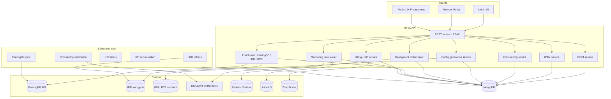
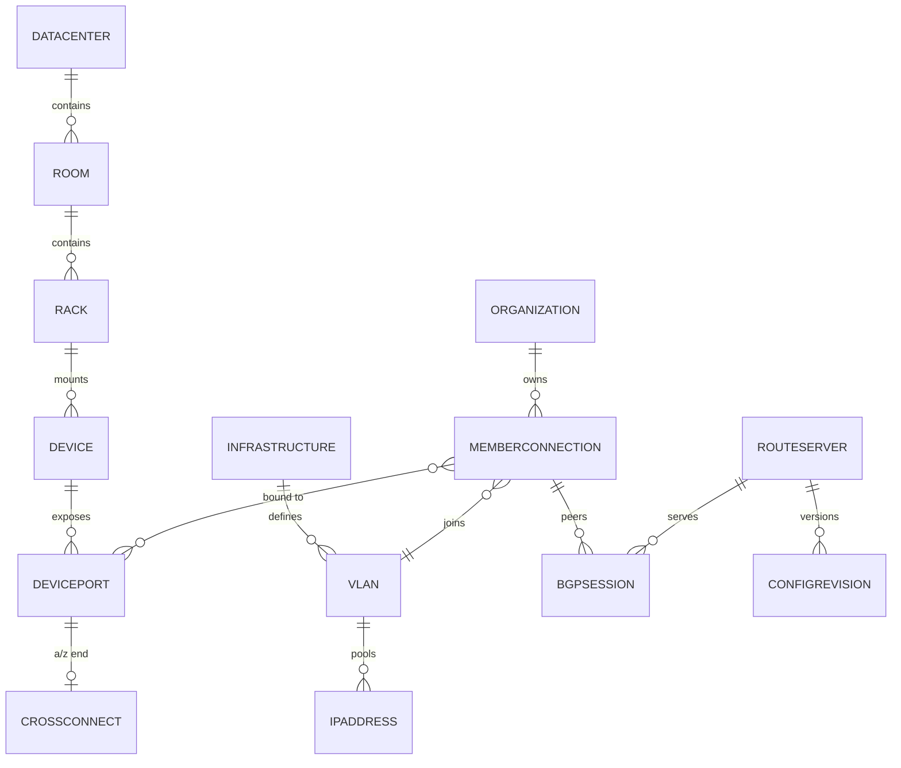
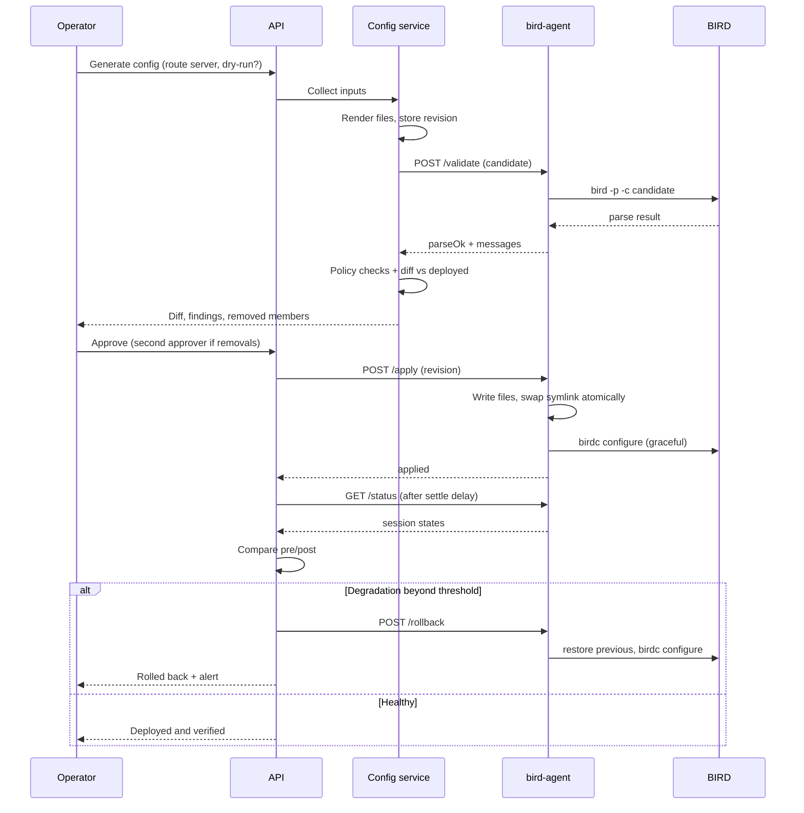
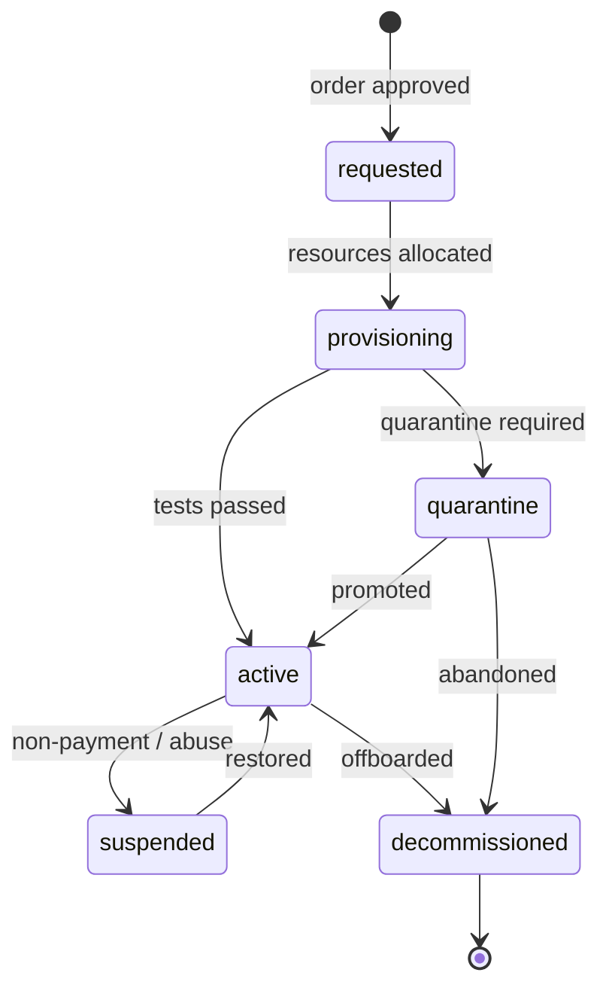

# Design Document

## Overview

This design turns MX-IX into the single source of truth for the exchange. It
adds a DCIM layer (facilities → racks → devices → ports → cabling), an IXP
logical layer (infrastructures → VLANs → IPAM → member connections → BGP
sessions), and an automation layer (PeeringDB enrichment, IRR/RPKI filtering,
BIRD configuration generation, validated deployment, monitoring provisioning).

The guiding constraint: **an operator adds a member once, in MX-IX, and every
downstream artefact — addressing, cabling record, route-server session, monitoring
host, public listing, invoice input — is derived from that one record.**

### Design principles

1. **Derive, don't duplicate.** Rack occupancy, IP availability, port availability
   and route-server config are all computed from primary records, never entered twice.
2. **Generation is always safe; deployment is always gated.** Rendering config has
   no side effects. Reaching a route server requires validation, a reviewed diff,
   and an approver.
3. **Degrade to last-known-good.** External dependencies (PeeringDB, IRR, RPKI)
   must never produce an empty filter or block a deployment. Stale-but-valid beats
   absent.
4. **Reuse what exists.** `Organization`, `Location`, `Order`, `Member`,
   `RouteServer`, admin auth, audit log, notifications and the portal shell stay.
   `Port` is superseded by `MemberConnection` through a migration, not a rewrite.

## Architecture



### Layering

| Layer | Responsibility | Never does |
|---|---|---|
| Routes | RBAC, validation, shaping responses | Business logic |
| Services | Invariants, allocation, generation | Direct HTTP handling |
| Jobs | Scheduled reconciliation | Interactive mutations |
| Agent | Local file + daemon control on RS host | Decide policy |

## Components and Interfaces

| Component | Responsibility | Key interface | Depends on |
|---|---|---|---|
| **DCIM service** | Facilities, racks, devices, ports, cabling. Owns U-overlap and port-exclusivity invariants. | `placeDevice`, `movePort`, `createCrossConnect`, `tracePath`, `rackElevation` | Mongo |
| **IPAM service** | VLAN pools, reservation, allocation, release. Owns address uniqueness and pool conservation. | `materialisePool`, `allocate`, `reserve`, `release`, `utilisation` | Mongo |
| **Provisioning service** | Connection lifecycle and the state machine. Orchestrates the other services per transition. | `createFromOrder`, `transition`, `promoteFromQuarantine`, `decommission` | DCIM, IPAM, Config, Monitoring |
| **Enrichment service** | PeeringDB and IRR fetching plus caching, with stale-tolerant reads. | `lookupAsn`, `syncNetwork`, `refreshPrefixSet`, `getPrefixSet` | PeeringDB, bgpq4 |
| **Config generation service** | Renders route-server and switch configuration from database state; stores immutable revisions; computes diffs. | `generate`, `diff`, `getRevision`, `renderSwitchPort` | Enrichment, Mongo |
| **Deployment orchestrator** | Validation, approval enforcement, apply, verify, rollback. The only component that talks to agents. | `validate`, `approve`, `deploy`, `verify`, `rollback` | Agent, Config |
| **Monitoring provisioner** | Creates and removes monitoring objects; records their ids on the connection. | `provision`, `deprovision`, `registerLookingGlassSource` | Zabbix, Grafana, Alice-LG |
| **Billing service** | p95 computation, billing runs, export. | `accumulate`, `buildRun`, `approveRun`, `export` | Grafana/Zabbix, Zoho |
| **Reporting service** | Read-only aggregations for Flow C dashboards and reports. | `capacity`, `rpkiStatus`, `prefixLimits`, `freePorts`, `availability` | Mongo, metrics |
| **bird-agent** | Host-local file placement and daemon control on a route server. | `POST /validate`, `POST /apply`, `GET /status`, `POST /rollback`, `GET /running` | BIRD |

Service boundaries are enforced by dependency direction: routes call services,
services call other services downward only, and nothing but the deployment
orchestrator may reach an agent. This keeps the risky surface small and auditable.

## Data Models

All collections are Mongo. Naming follows the existing camelCase model style.
`_ref` denotes an ObjectId reference.

### DCIM layer

**`datacenters`**
`name`, `code` (unique), `location_ref` (existing `Location`), `address`, `city`,
`country`, `status` (`active|planned|decommissioned`), `notes`

**`rooms`**
`datacenter_ref`, `name`, `floor`, `notes`
Unique: `(datacenter_ref, name)`

**`racks`**
`datacenter_ref`, `room_ref`, `name`, `heightU` (default 42), `powerCapacityKw`,
`maxWeightKg`, `status`, `notes`
Unique: `(datacenter_ref, name)`

> Rack units are **not** a collection. Occupancy is derived from device
> `startU + heightU`. Storing 42 documents per rack would add cost and no value.

**`devices`**
`rack_ref`, `name`, `type` (`switch|router|patch-panel|server|console-server|other`),
`vendor`, `model`, `os`, `serial`, `assetTag`, `heightU`, `startU`,
`managementIp`, `powerDrawW`, `infrastructure_ref` (switches/routers only),
`status`, `notes`
Unique: `(rack_ref, name)`
Invariant: no U-range overlap within a rack — enforced by a pre-write range query
inside a transaction.

**`devicePorts`**
`device_ref`, `name`, `label`, `portType` (`ethernet|patch|console`),
`speed` (`1G|10G|25G|40G|100G|400G|null`), `media` (`fiber-sm|fiber-mm|copper`),
`connector` (`LC|SC|MPO|RJ45`), `status` (`free|connected|reserved|faulty|disabled`),
`adminStatus`, `operStatus`, `reservedFor_ref`, `notes`
Unique: `(device_ref, name)`

**`crossConnects`**
`label`, `aPort_ref`, `zPort_ref`, `cableType`, `lengthM`,
`status` (`planned|active|decommissioned`), `dcReference` (carrier's XC ID),
`organization_ref` (when member-facing), `notes`
Unique partial index on `aPort_ref` and `zPort_ref` where `status = 'active'`
— a port cannot hold two active cross-connects.

**`coreBundles`**
`name`, `aDevice_ref`, `zDevice_ref`, `memberPortPairs[{aPort_ref, zPort_ref}]`,
`capacityGbps` (derived), `status`

**`consolePorts`**
`consoleServer_ref` (a `devices` row), `portNumber`, `targetDevice_ref`,
`accessMethod`, `credentialRef` (secret store key — never plaintext)

### IXP logical layer

**`infrastructures`**
`name`, `shortname`, `ixfId`, `datacenters[]`, `isPrimary`, `status`

**`vlans`**
`infrastructure_ref`, `tag`, `name`, `type` (`peering|quarantine|private`),
`ipv4 {network, prefixLength, gateway}`, `ipv6 {network, prefixLength, gateway}`,
`status`
Unique: `(infrastructure_ref, tag)`

**`ipAddresses`**
`vlan_ref`, `family` (4|6), `address` (canonical string), `addressSort` (sortable
numeric/BigInt string), `status` (`free|assigned|reserved`),
`connection_ref`, `reservedReason`, `assignedAt`
Unique: `(vlan_ref, family, address)`
Pools are materialised on VLAN creation for IPv4; for IPv6 only reserved and
assigned addresses are materialised — a /64 cannot be enumerated.

**`memberConnections`** (replaces `ports`)
`organization_ref`, `name`, `infrastructure_ref`, `vlan_ref`,
`physicalPorts[]` → `devicePorts` refs (LAG when > 1),
`speedGbps` (derived from member ports), `lagName`,
`ipv4_ref`, `ipv6_ref`, `macAddresses[]`,
`state` (`requested|provisioning|quarantine|active|suspended|decommissioned`),
`routing {maxPrefix4, maxPrefix6, asSet, md5Set, isRsClient, communities[]}`,
`monitoring {zabbixHostId, zabbixInterface, grafanaUid}`,
`billing {billableFromm, portFeeRef}`,
`legacyPortId` (migration trace), `order_ref`, `notes`

**`bgpSessions`**
`connection_ref`, `routeServer_ref`, `family` (4|6), `peerIp`, `peerAsn`,
`maxPrefix`, `md5Enabled`, `enabled`,
`state` (`configured|established|down|withdrawn`), `lastStateChange`
Unique: `(routeServer_ref, peerIp)`

### Automation & enrichment layer

**`peeringDbNetworks`** (cache)
`asn` (unique), `name`, `aka`, `infoPrefixes4`, `infoPrefixes6`, `irrAsSet`,
`policyGeneral`, `infoType`, `contacts[]`, `netixlans[]`, `raw`,
`lastSyncedAt`, `syncError`

**`irrPrefixSets`** (cache)
`asn`, `asSet`, `family`, `prefixes[]`, `prefixCount`, `source`,
`generatedAt`, `lastGoodAt`, `lastError`
Unique: `(asn, family)`

**`configRevisions`** (immutable)
`routeServer_ref`, `revision` (monotonic), `files[{path, content, sha256}]`,
`inputSummary {connectionCount, sessionCount, prefixSetAges}`,
`generatedBy`, `generatedAt`,
`validation {parseOk, policyOk, findings[]}`,
`diffAgainstRevision`, `diffSummary {added, changed, removed, removedMembers[]}`,
`approval {approvedBy, approvedAt, secondApproverBy}`,
`deployment {status, deployedAt, verifiedAt, rolledBackFrom, agentResponse}`

**`deployJobs`**
`configRevision_ref`, `routeServer_ref`, `mode` (`dry-run|deploy|rollback`),
`status` (`queued|running|verifying|succeeded|failed|rolled-back`),
`startedAt`, `finishedAt`, `log[]`, `preSessionState`, `postSessionState`

**`configDrifts`**
`routeServer_ref`, `detectedAt`, `expectedRevision_ref`, `diff`, `acknowledgedBy`

### Member-facing support collections

**`contacts`** — `organization_ref`, `name`, `role`, `email`, `phone`, `groups[]`, `isPrimary`
**`documents`** — `organization_ref`, `filename`, `storageKey`, `type`, `sizeBytes`, `mimeType`, `memberVisible`, `uploadedBy`, `uploadedAt`
**`apiKeys`** — `organization_ref`, `name`, `keyHash`, `prefix`, `scopes[]`, `createdBy`, `lastUsedAt`, `revokedAt`
**`maintenanceWindows`** — `title`, `description`, `startsAt`, `endsAt`, `impact`, `affectedComponents[]`, `affectedConnections[]`, `notifiedAt`, `status`
**`billingRuns`** — `periodStart`, `periodEnd`, `status` (`draft|approved|exported`), `lines[{organization_ref, connection_ref, p95In, p95Out, p95Billable, unit, dataCompleteness}]`, `approvedBy`, `exportedAt`

### Relationship summary



## Critical Design Decisions

### Allocation atomicity without relying on transactions

The production MongoDB is standalone, so multi-document transactions are
unavailable. Two mitigations, both applied:

1. **Convert to a single-node replica set.** Same performance profile, unlocks
   transactions. Required for rack-placement and promote-from-quarantine flows
   that touch several documents.
2. **Prefer single-document conditional updates** for the hot path. IP allocation
   is a compare-and-set, which is atomic in Mongo without a transaction:

```ts
const ip = await IpAddress.findOneAndUpdate(
  { vlan_ref, family, status: 'free' },       // guard is part of the query
  { $set: { status: 'assigned', connection_ref, assignedAt: new Date() } },
  { sort: { addressSort: 1 }, new: true }
);
if (!ip) throw new AllocationError('No free address in pool');
```

The same pattern reserves a switch port (`status: 'free'` → `'reserved'`). Rack
U placement cannot be expressed as one document update, so it runs in a
transaction with an overlap guard:

```
overlap exists if  existing.startU < (new.startU + new.heightU)
               and new.startU     < (existing.startU + existing.heightU)
```

### Why route-server config is generated per member file

A monolithic config means every change rewrites everything, so every diff is
large and reviewers stop reading them. Per-member includes keep the diff
proportional to the change, which is what makes Requirement 23's review gate
meaningful rather than ceremonial.

## Configuration Pipeline



### Agent contract

A small daemon on each route-server host. Chosen over SSH so the application
never holds shell or sudo rights, and every action is an auditable call.

| Method | Purpose | Notes |
|---|---|---|
| `POST /validate` | Parse a candidate config | No side effects |
| `POST /apply` | Write revision, swap symlink, graceful reload | Idempotent by revision id |
| `GET /status` | Daemon + per-protocol session states | Used pre/post deploy |
| `POST /rollback` | Restore a retained revision and reload | Bounded by retention |
| `GET /running` | Hash + content of running config | Drift detection |

Auth: bearer token per host, TLS, source-IP allow-list. The agent refuses any
path outside its configured config directory and never executes operator-supplied
shell.

### Policy guards enforced at generation time

| Guard | Rule | Rationale |
|---|---|---|
| Prefix filter present | Every session must reference a non-empty prefix set | An empty filter is a route leak |
| Max-prefix present | Every session must have a limit with an action | Protects the fabric from a member's mistake |
| Max-prefix sanity | Clamp PeeringDB value to `[floor, ceiling]` | `info_prefixes4: 0` would drop the session |
| Prefix-set freshness | Warn beyond a threshold age, never substitute empty | Stale beats absent |
| RPKI reachability | Validator down ⇒ treat as not-found, accept | Fail-closed would drop everything |
| Reload mode | Graceful by default; hard reload is a separate action | Hard reload resets sessions |

## Provisioning State Machine



Each transition names its side effects, so provisioning is reproducible:

| Transition | Side effects |
|---|---|
| `requested → provisioning` | Reserve ports, create connection, assign VLAN, allocate IPs, set routing defaults from PeeringDB |
| `provisioning → quarantine` | Generate config for quarantine VLAN only; excluded from production revisions |
| `→ active` | Generate + deploy production session, provision monitoring, notify member, set billable date, include in IX-F export |
| `active → suspended` | Disable sessions (config regenerated with session disabled), retain allocations, notify |
| `suspended → active` | Re-enable sessions, no re-allocation |
| `→ decommissioned` | Withdraw sessions, release IPs to `free`, mark cross-connects for removal, free ports, disable monitoring, retain record and documents |

## External Integrations

| System | Direction | Failure behaviour |
|---|---|---|
| PeeringDB | In: enrichment, prefix limits, AS-SET, contacts. Out: presence via IX-F | Serve cached values, mark stale |
| IRR (bgpq4) | In: prefix sets per AS-SET | Keep last-good set, alert, never emit empty |
| RPKI RTR | In: validator endpoints referenced by generated policy | Policy treats unknown as not-found |
| Zabbix / Grafana | Out: host + interface creation. In: metrics | Activate anyway, flag unmonitored, raise task |
| Alice-LG | Out: register route servers as sources | Non-blocking |
| Zoho Books | Out: approved p95 figures | Billing run stays `approved`, retried |

## API Surface (additions)

Admin, all behind existing admin auth with `admin|super-admin|noc` for writes:

```
/api/admin/dcim/datacenters        CRUD
/api/admin/dcim/rooms              CRUD
/api/admin/dcim/racks              CRUD, GET /:id/elevation
/api/admin/dcim/devices            CRUD, POST /:id/ports (bulk create)
/api/admin/dcim/ports              GET (filter), PATCH /:id
/api/admin/dcim/cross-connects     CRUD, GET /:id/path
/api/admin/dcim/core-bundles       CRUD
/api/admin/ixp/infrastructures     CRUD
/api/admin/ixp/vlans               CRUD, GET /:id/utilisation
/api/admin/ixp/ip-addresses        GET, POST /reserve, POST /release
/api/admin/ixp/connections         CRUD, POST /:id/transition
/api/admin/ixp/sessions            CRUD
/api/admin/config/:rsId/generate   POST  (dry-run capable)
/api/admin/config/:rsId/revisions  GET, GET /:rev, GET /:rev/diff
/api/admin/config/:rev/approve     POST
/api/admin/config/:rev/deploy      POST
/api/admin/config/:rev/rollback    POST
/api/admin/enrichment/peeringdb/:asn   GET, POST /sync
/api/admin/enrichment/irr/:asn         POST /refresh
/api/admin/reports/*               GET (capacity, rpki, prefix-limits, free-ports, xc, availability)
/api/admin/billing/runs            GET, POST, POST /:id/approve, POST /:id/export
/api/admin/maintenance             CRUD
```

Portal (member-scoped, `portalAuthMiddleware`):

```
/api/portal/connections            GET (own, with VLAN + IPs + MACs)
/api/portal/contacts               CRUD (own)
/api/portal/documents              GET, GET /:id/download (member-visible only)
/api/portal/maintenance            GET (affecting own connections)
/api/portal/api-keys               GET, POST, DELETE
```

Public:

```
/api/ix-f/member-export/1.0        GET (unauthenticated, active connections only)
```

## Error Handling

| Class | Response | Example |
|---|---|---|
| Validation | 400 with field-level detail | Bad MAC, U out of range |
| Conflict / invariant | 409 with the conflicting entity | Port already connected, IP taken, U overlap |
| Dependency block | 409 listing dependents | Deleting a rack holding devices |
| Exhaustion | 409 with pool state | No free address in VLAN |
| External dependency | 200 with `degraded` flag, or 502 for direct proxies | PeeringDB stale |
| Deployment refused | 422 with findings | Parse error, missing filter |
| Deployment failed | 500 plus a `deployJobs` record and rollback state | Agent unreachable mid-apply |

Allocation and deployment errors are never silently swallowed: every failed
allocation releases what it reserved, and every failed deployment leaves a
`deployJobs` row explaining where it stopped.

## Correctness Properties

These are the statements that must hold for **every** input sequence, not merely
the cases we happen to write examples for. They are the specification the
implementation is tested against.

### Property 1: IP address uniqueness
For any interleaving of allocation requests against a VLAN, no address is ever assigned to two connections.

### Property 2: Address pool conservation
After any sequence of operations, `free + assigned + reserved` equals the materialised pool size for that VLAN and family.

### Property 3: Allocation release round-trip
Allocating resources for a connection and then decommissioning it restores the pool and port states to their prior values.

### Property 4: Allocation atomicity
A failed allocation leaves no partially reserved resources behind.

### Property 5: Rack placement non-overlap
For any set of accepted placements in a rack, no two devices' U ranges intersect.

### Property 6: Rack containment
Every accepted placement satisfies `1 ≤ startU` and `startU + heightU - 1 ≤ rack.heightU`.

### Property 7: Cross-connect exclusivity
No device port is an endpoint of more than one `active` cross-connect.

### Property 8: Port single-use
No device port is bound to more than one non-decommissioned member connection.

### Property 9: Referential integrity
No delete operation leaves an orphan room, rack, device, port, connection or session.

### Property 10: Configuration generation totality
Every `active` route-server-client connection yields exactly one session block per address family per route server.

### Property 11: Quarantine exclusion
No connection in `quarantine` or `decommissioned` state appears in a production route-server revision.

### Property 12: Prefix filter non-emptiness
No generated session references an empty prefix set.

### Property 13: Max-prefix limit presence
No generated session omits a max-prefix limit and its action.

### Property 14: Max-prefix clamping
Every generated max-prefix lies within the configured floor and ceiling regardless of the upstream value supplied.

### Property 15: Generation determinism
Generating twice from identical database state produces byte-identical files.

### Property 16: Diff soundness
If a revision removes or disables a session present in the previous revision, the diff summary names the affected member.

### Property 17: Revision immutability
A stored revision's file contents and hashes never change after creation.

### Property 18: Deployment gate enforcement
No revision reaches an agent's apply endpoint without a passing validation and a recorded approval.

### Property 19: Session removal escalation
A revision whose diff removes sessions requires an approver distinct from its author.

### Property 20: Rollback availability
For any deployed revision, a retained previous revision exists to roll back to, up to the configured retention limit.

### Property 21: Post-deploy verification response
If established sessions after deployment fall below the configured threshold, the system rolls back and records the reason.

### Property 22: Dry-run purity
A dry-run performs no write to any agent and leaves no deployment state.

### Property 23: State machine legality
Only transitions enumerated in the state table are accepted from any given state.

### Property 24: Suspension reversibility
Suspending and then restoring a connection yields the same routing configuration as before suspension.

### Property 25: Member isolation
No portal response for one member contains any resource belonging to another member.

### Property 26: Public export scoping
The public IX-F export contains only `active` connections and no commercial or physical-placement data.

### Property 27: External dependency degradation tolerance
With PeeringDB, IRR or the RPKI validator unreachable, generation still succeeds using last-known-good data and marks the result stale.

## Testing Strategy

**Property-based tests** implement the properties above as executable
specifications, generating operation sequences (including concurrent allocations
and random placement attempts) rather than fixed fixtures. P1–P4 and P5–P6 are the
highest-value targets because they are exactly the failures that are invisible
until they corrupt production data.

**Integration tests** cover the pipeline against a containerised BIRD: generate →
validate → apply → verify → rollback, including the degradation-triggered
automatic rollback path (P21) and gate enforcement (P18, P19).

**Contract tests** pin the agent API and the IX-F export schema.

**Migration tests** assert that every existing `Port` becomes exactly one
`MemberConnection` with its organisation, speed, VLAN and IPs preserved, and that
`Netlayer` (AS50839) and route-server ASN 141539 survive intact.

## Migration Strategy

Phased, reversible, and with a parallel-run period for the risky part.

| Stage | Action | Reversible? |
|---|---|---|
| 1 | Add new collections alongside existing ones. No writes change. | Yes |
| 2 | Import facilities, racks, devices and ports (manual entry + IX-F import for members/ports) | Yes |
| 3 | Materialise VLAN pools; import existing IPs as `assigned` | Yes |
| 4 | Create `MemberConnection` per existing `Port`, keeping `legacyPortId` | Yes |
| 5 | Switch admin and portal reads to `MemberConnection`; `Port` becomes read-only | Yes, flag-controlled |
| 6 | Generate route-server config in **compare mode** only, diffing against the config IXP Manager produces | Yes |
| 7 | After a sustained period of zero meaningful diff, cut deployment over to MX-IX | Yes, via rollback |
| 8 | Disable the IXP Manager integration; retain the import path | Yes |

Stage 6 is the safeguard for the whole project: it proves the generator agrees
with a system that has been correct in production before any traffic depends on it.

**Validates: Requirements 19.5, 20.3, 21.3**

**Validates: Requirements 29.2, 29.3**

**Validates: Requirements 12.2, 18.4**

**Validates: Requirements 34.1, 34.2**

**Validates: Requirements 7.5, 13.2**

**Validates: Requirements 24.7**

**Validates: Requirements 24.5, 24.6**

**Validates: Requirements 24.4**

**Validates: Requirements 23.4, 23.6**

**Validates: Requirements 23.1, 23.5, 24.1**

**Validates: Requirements 22.5, 22.6**

**Validates: Requirements 23.3, 23.4**

**Validates: Requirements 22.5, 37.1**

**Validates: Requirements 19.4, 22.3**

**Validates: Requirements 22.3, 23.2**

**Validates: Requirements 20.3, 23.2**

**Validates: Requirements 26.3**

**Validates: Requirements 22.1, 22.4**

**Validates: Requirements 1.4, 16.1**

**Validates: Requirements 6.2**

**Validates: Requirements 5.2, 16.2**

**Validates: Requirements 2.1, 2.4**

**Validates: Requirements 2.3, 2.4**

**Validates: Requirements 16.1, 16.3**

**Validates: Requirements 9.3, 34.3**

**Validates: Requirements 9.1, 9.4**


**Validates: Requirements 9.1, 9.2**